# Домашнее задание 4. Dockerfile по правилам

Автор: Литвинов Александр Романович, ГО1, 19.04.2026

Если для проверки задания обязательно требуется запущенное приложение на облачном сервере и доступное в момент оценивания, 
то прошу предоставить бесплатный, учебный сервер с внешним ip-адресом - иначе это требование не валидно, так как требует финансовых затрат.

### Написать Dockerfile

За основу взять код из репозитория [uv-docker-example на GitHub](https://github.com/astral-sh/uv-docker-example). Использование готовых slim-версий позволяет использовать минимум ресурсов для сборки образов, так же в них оставлены только необходимые для работы инструменты, облегченная ОС.

Так же создан `.dockerignore` и заполнен исключениями для сборки - [ресурс](https://gist.github.com/KernelA/04b4d7691f28e264f72e76cfd724d448).

```dockerfile
FROM ghcr.io/astral-sh/uv:python3.12-bookworm-slim AS builder

WORKDIR /app

COPY uv.lock pyproject.toml ./

ENV UV_COMPILE_BYTECODE=1 \
    UV_LINK_MODE=copy \
    UV_NO_DEV=1 \
    UV_PROJECT_ENVIRONMENT=/app/.venv

RUN --mount=type=cache,target=/root/.cache/uv \
    uv sync --locked --no-install-project --no-dev


FROM python:3.12-slim AS runtime

RUN apt-get update && \
    apt-get install -y --no-install-recommends \
    && apt-get clean \
    && rm -rf /var/lib/apt/lists/*

WORKDIR /app

COPY --from=builder /app/.venv /app/.venv

COPY . /app

ENV PATH="/app/.venv/bin:$PATH" \
    PYTHONUNBUFFERED=1 \
    PYTHONDONTWRITEBYTECODE=1

CMD ["uvicorn", "main:app", "--host", "0.0.0.0", "--port", "8000"]
```

1. Установка Docker на облачный сервер

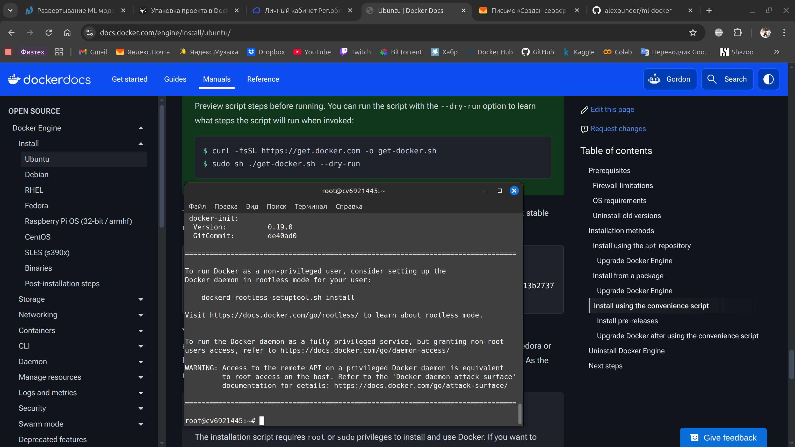

2. Клонирование файлов из репозитория с кодом проекта

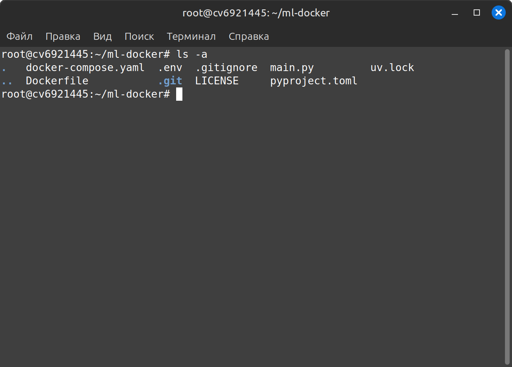

3. Демонстрация сборки образа

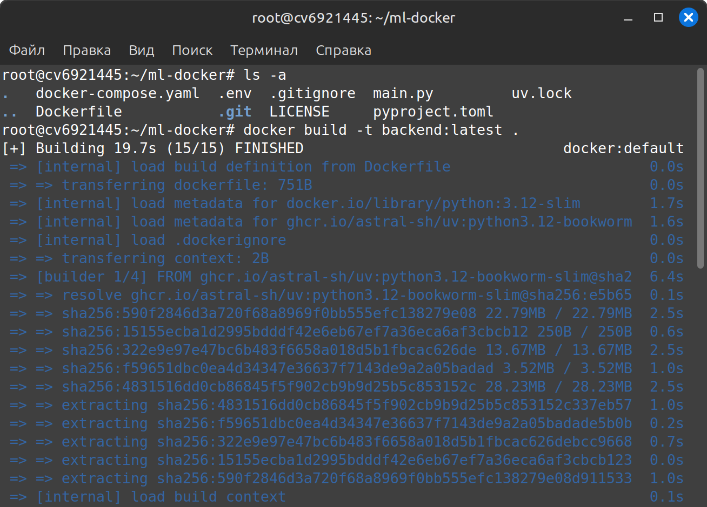

4. Запуск образа

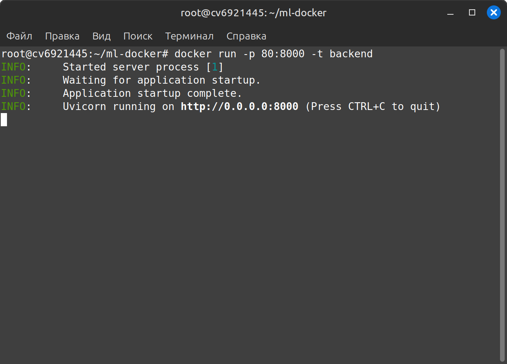

5. Проверка в браузере

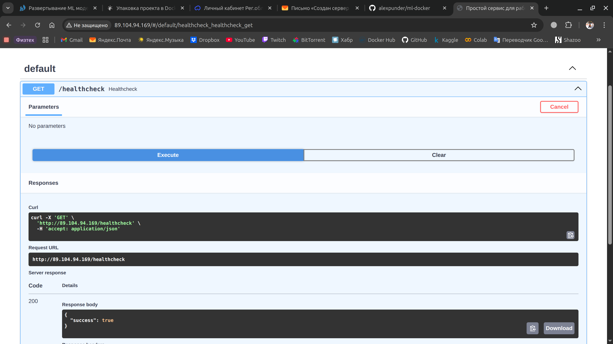


### Написать Docker compose

Ресурсы настраивались исходя из ресурсов арендованного сервера: `1 cpu, 2gb ram, 10gb ssd`. 
Однако, не ожидал, что `MLflow` такой прожорливый и изначально выделенных 500мб ему не хватит и ОС будет убивать процесс по памяти. 
Для каждого сервиса реализован простой `healthcheck` - curl-запрос с успешным или нет ответом. 
Хранение данных реализовано в отдельном томе для postgres - так, при перезапуске, миграции и записи БД будут сохранены.

(Возможно, требование по портам, открытыми наружу, несколько преувеличено, ведь в действительности все они скрыты за, условным, 
Nginx или ufw, которые разрешают входящий трафик только на порт 80 (и 443). Поэтому какие бы порты не были доступны вне контейнерезации, 
получить доступ из вне стремится к 0).

```yaml
name: ml-project

volumes:
  pg-data:

networks:
  ml-infra:
    driver: bridge

services:

  backend:
    build:
      context: .
      dockerfile: Dockerfile
    profiles:
      - development
    env_file:
      - .env
    ports:
      - 8000:8000
    networks:
      - ml-infra
    
    cpus: 0.5
    mem_limit: 512M
    mem_reservation: 256M

    healthcheck:
      test: ["CMD-SHELL", "curl -f http://localhost:8000/healthcheck || exit 1"]
      interval: 30s
      timeout: 2s
      retries: 3
      start_period: 30s

    depends_on:
      db:
        condition: service_healthy
      mlserver:
        condition: service_started

  mlserver:
    image: burakince/mlflow:latest
    profiles:
      - development
      - production
    environment:
      - MLFLOW_HOST=0.0.0.0
      - MLFLOW_PORT=5000
    networks:
      - ml-infra

    cpus: 0.3
    mem_limit: 512M
    mem_reservation: 256M

    healthcheck:
      test: ["CMD-SHELL", "curl -f http://localhost:5000/health || exit 1"]
      interval: 30s
      timeout: 5s
      retries: 3
      start_period: 30s

  db:
    image: postgres:16-alpine
    profiles:
      - development
      - production
    environment:
        POSTGRES_USER: postgres
        POSTGRES_PASSWORD: secretpwd
        POSTGRES_DB: postgres
    env_file:
      - .env
    volumes:
      - pg-data:/var/lib/postgresql/data
    networks:
      - ml-infra
    
    cpus: 0.2
    mem_limit: 256M
    mem_reservation: 128M

    healthcheck:
      test: ["CMD-SHELL", "pg_isready -U postgres"]
      interval: 10s
      timeout: 3s
      retries: 3
      start_period: 30s
```

1. Запуск docker compose на облачном сервере

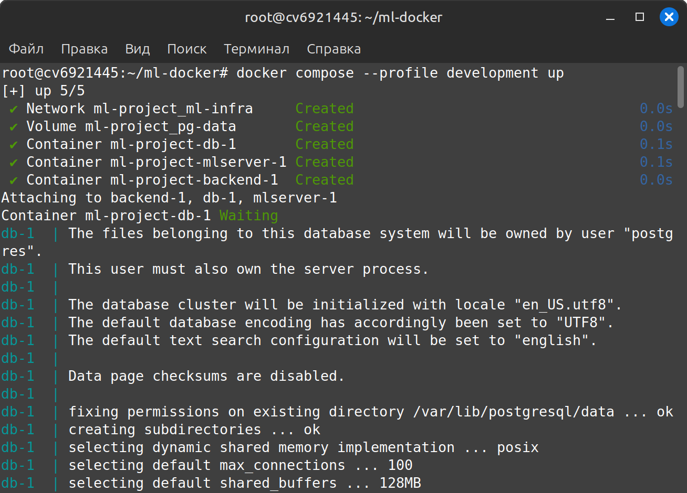

2. Сервис запущен, логи

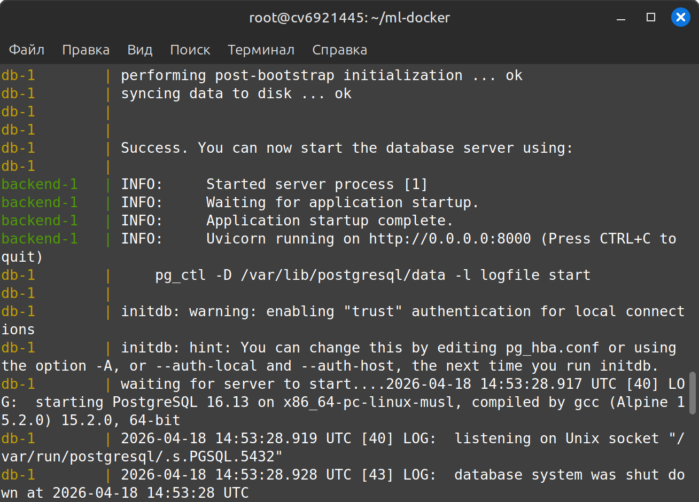

3. Проверка в браузере

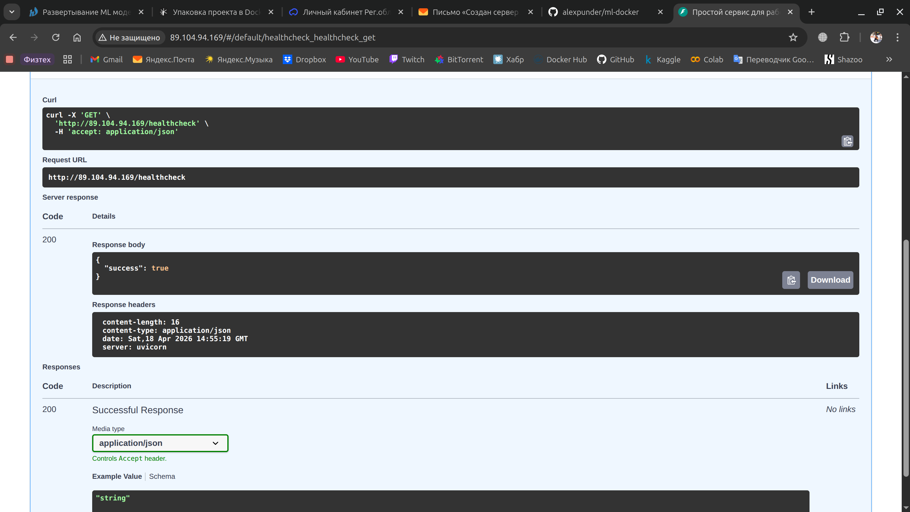

4. Демонстрация полученных образов, тяжеловесность образа backend-сервиса

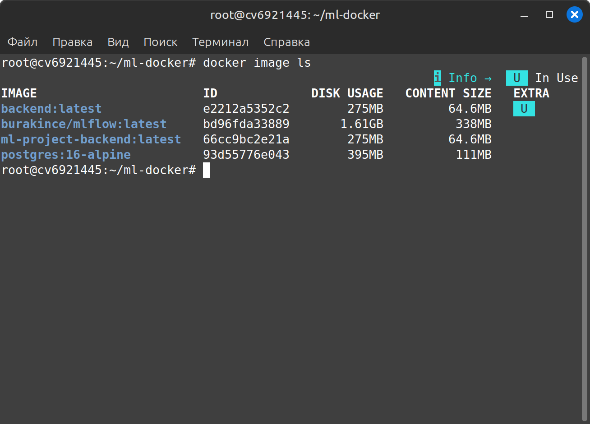


### Настроить k8s

Для этих целей я воспользовался [kind](https://kind.sigs.k8s.io/docs/user/quick-start). 
Первой мыслью было не писать с 0 конфигурационный файл, а воспользоваться [Kompose](https://kompose.io/), 
ведь у нас уже есть гововый docker-compose.yaml. Однако, проблем возникло больше, чем положено - пришлось отказаться.

Кластер удалось поднять и запустить, однако внешнего доступа к нему нет: пробовал использовать разные порты, 
отключал ufw - судя по всему, у облачного провайдера заблокирована такая возможность, так как есть отдельный тариф под k8s. 
Если выполнять curl-запрос внутри сервера, то все работает и доступно, нет доступа во вне.

```yaml
apiVersion: v1
kind: Pod
metadata:
  name: backend
  labels:
    app: backend
spec:
  containers:
  - name: backend
    image: backend:latest
    imagePullPolicy: IfNotPresent
    ports:
    - containerPort: 8000
---
apiVersion: v1
kind: Service
metadata:
  name: backend
spec:
  type: NodePort
  selector:
    app: backend
  ports:
  - port: 8000
    nodePort: 30080
```

1. Установка `kind`

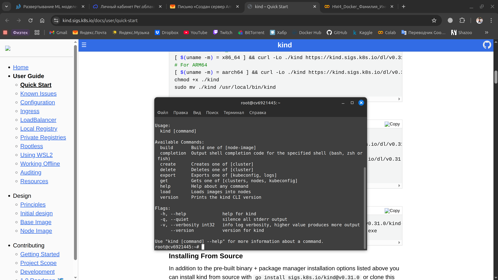

2. Создание кластера

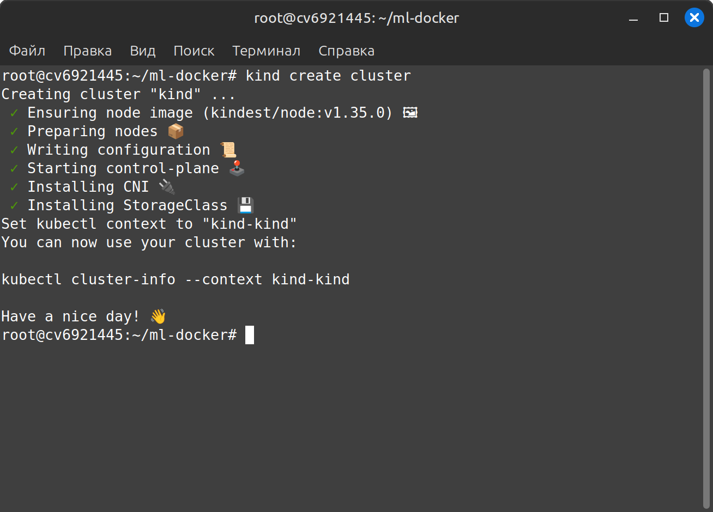

3. Загрузка образа в кластер

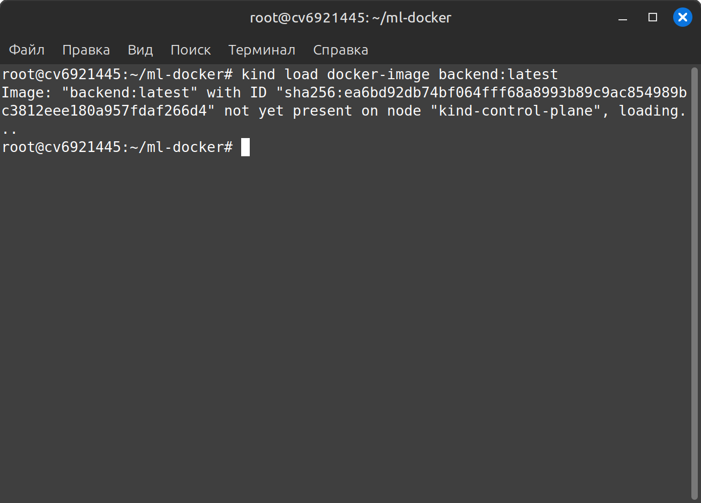

4. Применение

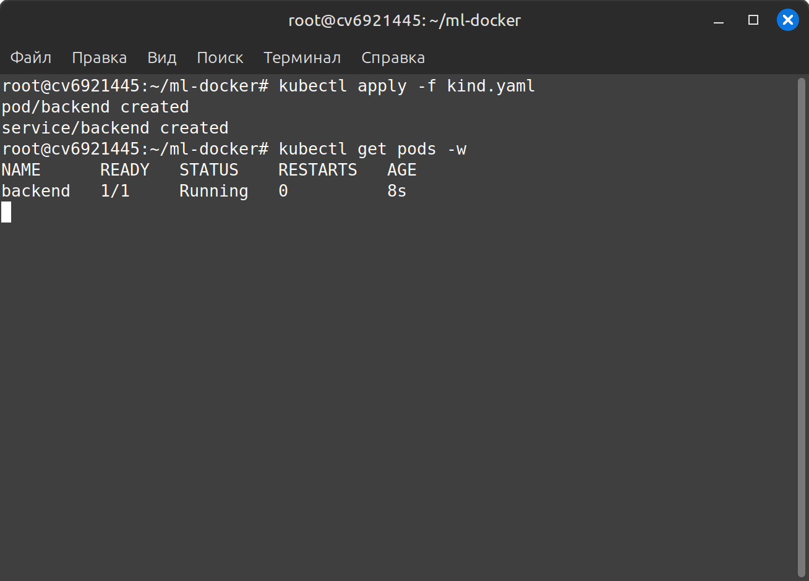

5. Проверка в браузере, локальный запрос с сервера

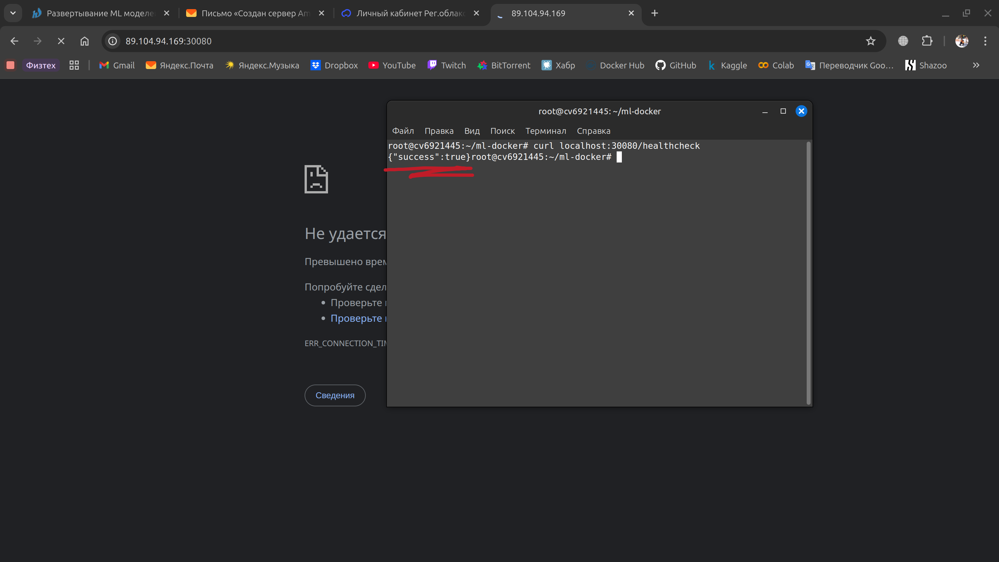
